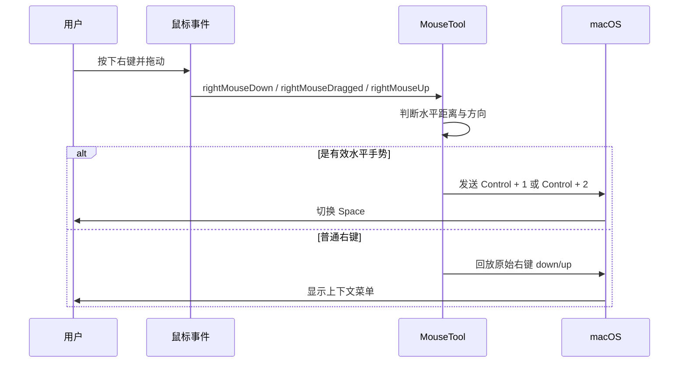

# MouseTool

<p align="center">
  
</p>

<p align="center">
  <strong>一个轻量、安静、专注的 macOS 菜单栏鼠标工具。</strong>
</p>

<p align="center">
  
  
  
  
  
</p>

MouseTool 运行在 macOS 菜单栏中，帮助外接鼠标用户用更少的动作完成常用桌面操作：

- 按住鼠标右键水平拖动，快速切换 Mission Control Space。
- 可选开启鼠标垂直滚动反转，不影响触控板自然滚动。
- 支持辅助功能权限状态检测、事件监听重启、开机自动启动。
- 不显示 Dock 图标，不打扰当前工作流。

## 功能亮点

| 能力 | 说明 |
| --- | --- |
| 右键快捷手势 | 按住右键向左或向右拖动，触发 Space 切换。 |
| 鼠标滚动反转 | 可单独开启垂直滚动反转，主要面向外接鼠标滚轮。 |
| 菜单栏控制 | 一键启停手势、重启事件监听、打开辅助功能设置、配置开机启动。 |
| 轻量实现 | 原生 Swift + AppKit，无第三方依赖。 |

## 系统要求

- macOS 13.5 或更高版本。
- Xcode 15 或更高版本用于本地构建。
- 需要授予“辅助功能”权限。
- 需要在系统设置中启用 Mission Control 的 Space 切换快捷键。

## 安装与运行

### 方式一：使用 Xcode 运行

1. 克隆或下载本仓库。
2. 使用 Xcode 打开 `MouseTool.xcodeproj`。
3. 选择 `MouseTool` scheme。
4. 点击 Run。
5. 按照系统弹窗授予辅助功能权限。

### 方式二：命令行构建

```sh
xcodebuild -project MouseTool.xcodeproj -scheme MouseTool -configuration Debug build
```

构建完成后，可以在 Xcode 的 DerivedData 产物目录中找到 `MouseTool.app`。如果只是本机日常使用，建议直接执行 [构建 Release](#构建-release) 中的命令，会自动复制产物安装到 `/Applications`。

## 首次配置

MouseTool 依赖 macOS 系统快捷键完成 Space 切换。首次使用前请完成下面两项设置。

### 1. 启用辅助功能权限

打开：

```text
系统设置 -> 隐私与安全性 -> 辅助功能
```

添加或启用 `MouseTool`。应用首次启动时会自动请求该权限，也可以从菜单栏中点击“打开辅助功能设置”。

### 2. 配置 Mission Control 快捷键

打开：

```text
系统设置 -> 键盘 -> 键盘快捷键 -> 调度中心
```

启用并配置：

| 系统动作 | 推荐快捷键 | MouseTool 触发场景 |
| --- | --- | --- |
| 向左移动一个空间 | `Control + 1` | 按住右键向右拖动 |
| 向右移动一个空间 | `Control + 2` | 按住右键向左拖动 |

> 当前实现发送的是 `Control + 1` 和 `Control + 2`。请确保系统快捷键与上表保持一致，否则 Space 不会切换。

## 工作原理

MouseTool 使用 `CGEventTap` 监听鼠标事件，并在识别到有效手势后发送系统快捷键。



滚动反转功能同时监听触控手势与滚轮事件：当事件更像来自外接鼠标时，反转垂直滚动 delta；当事件更像来自触控板时，保持原样。

## 开发

本项目是一个原生 macOS AppKit 应用，入口在 `main.swift`，主要逻辑集中在几个控制器中：

- `AppDelegate.swift`：应用生命周期、菜单栏图标、菜单项、开机启动。
- `MouseGestureController.swift`：右键拖动手势识别与右键事件回放。
- `MouseScrollReverserController.swift`：鼠标滚动垂直反转与触控板识别。
- `SpaceSwitcher.swift`：发送 Space 切换快捷键。
- `AccessibilityPermission.swift`：辅助功能权限检测、请求与设置跳转。

常用开发命令：

```sh
# Debug 构建
xcodebuild -project MouseTool.xcodeproj -scheme MouseTool -configuration Debug build

# 清理 Debug 构建
xcodebuild -project MouseTool.xcodeproj -scheme MouseTool -configuration Debug clean
```

如果 `xcodebuild` 提示缺少必要的 Xcode 首次启动内容，可以先执行：

```sh
xcodebuild -runFirstLaunch
```

## 构建 Release

在项目根目录执行：

```sh
xcodebuild -project MouseTool.xcodeproj -scheme MouseTool -configuration Release build
```

如果需要强制清理后重新构建：

```sh
xcodebuild -project MouseTool.xcodeproj -scheme MouseTool -configuration Release clean build
```

Release 构建脚本会在构建结束后复制：

```text
~/Library/Developer/Xcode/DerivedData/.../Build/Products/Release/MouseTool.app
```

到：

```text
/Applications/MouseTool.app
```

之后可以直接启动：

```sh
open /Applications/MouseTool.app
```

### 生成 Archive

如果需要保留 `.xcarchive`：

```sh
xcodebuild -project MouseTool.xcodeproj -scheme MouseTool -configuration Release -archivePath build/MouseTool.xcarchive archive
```

## 可调参数

手势参数位于 `MouseTool/MouseGestureController.swift`：

| 参数 | 默认值 | 说明 |
| --- | --- | --- |
| `switchThreshold` | `40` | 触发 Space 切换前需要拖动的最小水平距离。 |
| `directionLockRatio` | `1.25` | 水平位移相对于垂直位移的最小比例，用来避免斜向误触。 |
| `replayedEventMarker` | `0x4D_54_52_43` | 标记 MouseTool 回放的右键事件，避免被再次拦截。 |

滚动识别参数位于 `MouseTool/MouseScrollReverserController.swift`：

| 参数 | 默认值 | 说明 |
| --- | --- | --- |
| `touchToScrollThreshold` | `222_000_000ns` | 触控事件后多短时间内的连续滚动更倾向被识别为触控板。 |
| `mouseAfterTouchThreshold` | `333_000_000ns` | 触控结束后超过该间隔的普通滚动更倾向被识别为鼠标。 |

## 项目结构

```text
.
├── MouseTool/
│   ├── AppDelegate.swift
│   ├── AccessibilityPermission.swift
│   ├── MouseGestureController.swift
│   ├── MouseScrollReverserController.swift
│   ├── SpaceSwitcher.swift
│   ├── main.swift
│   ├── Info.plist
│   └── Assets.xcassets/
├── MouseTool.xcodeproj/
└── README.md
```

## 常见问题

### 手势被识别了，但 Space 没有切换

请检查 Mission Control 快捷键是否配置为 `Control + 1` 和 `Control + 2`。MouseTool 当前发送的是这两个组合键。

### 为什么需要辅助功能权限？

MouseTool 需要通过 `CGEventTap` 监听鼠标事件，并通过 `CGEvent` 发送快捷键。macOS 要求这类能力必须获得辅助功能授权。

### 普通右键菜单还能用吗？

可以。MouseTool 会先拦截右键 down/up，用于判断是否形成手势；如果没有达到触发条件，会回放原始右键事件。

### 滚动反转会影响触控板吗？

设计目标是只反转外接鼠标滚轮。代码会结合触控事件、连续滚动标记和时间窗口判断事件来源，但不同设备驱动可能存在差异。如果你的设备判断不准，可以先在菜单中关闭“滚动垂直反转”。

### 为什么应用没有 Dock 图标？

`Info.plist` 中启用了 `LSUIElement`，应用以菜单栏工具形式运行。

### 开机自动启动显示“需批准”怎么办？

打开：

```text
系统设置 -> 通用 -> 登录项
```

在登录项中批准 MouseTool 即可。

## 许可

本项目基于 [Apache License Version 2.0](LICENSE.txt) 开源。
